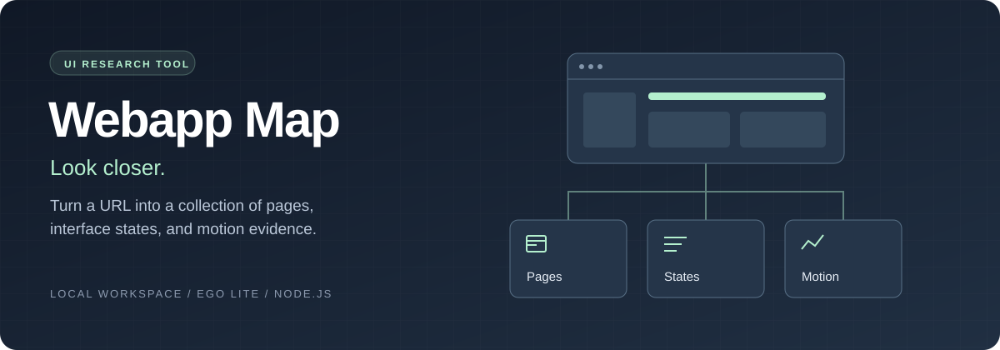
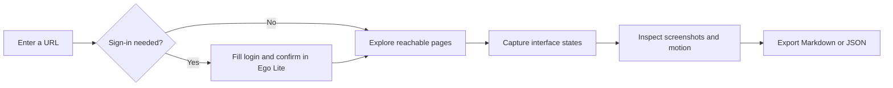

<p align="center">
  
</p>

<p align="center">
  <strong>A local workspace for understanding how web apps look and behave.</strong><br />
  Supply a URL, sign in when needed, and build a browsable UI research collection.
</p>

<p align="center">
  
  
  
  
</p>

<p align="center">
  <a href="#quick-start">Quick start</a> &nbsp; / &nbsp;
  <a href="#the-research-workflow">Workflow</a> &nbsp; / &nbsp;
  <a href="#what-you-get">Outputs</a> &nbsp; / &nbsp;
  <a href="#coverage-and-boundaries">Coverage</a>
</p>

## From browsing to evidence

Revisit a product's navigation, compare its interface states, and inspect the timing behind its motion. Webapp Map brings those observations together in a local collection you can use for design research and implementation references.

| Capture | Inspect |
| :--- | :--- |
| **Pages** | Full-page PNG screenshots of discovered same-origin routes, including hash routes. |
| **Interface states** | Selected tabs, disclosures, and scroll states, within limits you choose. |
| **Motion** | Animation targets, names, timing, easing, and keyframes exposed by the browser. |
| **Research notes** | Downloadable Markdown and JSON with route evidence and coverage status. |
| **Mobile layouts** | A mobile-width capture option for a separate research run. |

## Quick start

You need **Node.js 22+**, **Ego Lite**, and the **`ego-browser` CLI** installed and available on your PATH. Start Ego Lite before capturing.

```bash
git clone https://github.com/Jacknelson6/webapp-map.git
cd webapp-map
npm start
```

Open **[127.0.0.1:4317](http://127.0.0.1:4317)**. The app has no npm package dependencies to install.

On macOS, you can also double-click [`Launch.command`](Launch.command) to start the app and open it in Ego Lite. Stop the server with **Control-C** in its terminal.

## The research workflow



1. **Choose your starting point.** Enter an app URL or its login page. Set the page limit, states per page, and optional mobile width.
2. **Sign in when needed.** Expand the sign-in fields. Recognized forms are filled and submitted, then the app waits for confirmation. Complete MFA, SSO, or an unrecognized form directly in Ego Lite.
3. **Continue the capture.** Select **I'm signed in, continue** after login. The crawler explores same-site links and selected controls. Use **Refresh** to load progress or **Stop capture** to interrupt the run.
4. **Study the collection.** Open a screenshot at full size, expand its animation records, or download a report.

If login redirects to another origin before the fields are filled, finish sign-in manually in Ego Lite.

## What you get

Each run writes its evidence to its own local directory:

```text
captures/
└── <run-id>/
    ├── report.json         # Routes, states, motion evidence, and run status
    ├── capture-0001.png    # Captured page or interface state
    ├── capture-0002.png
    └── ...
```

The **Report** action generates a Markdown download from the saved JSON. The **JSON** action provides the structured evidence for further analysis.

<details>
<summary><strong>What an animation record tells you</strong></summary>

Records come from the browser's Web Animations API, including CSS animations and transitions. They preserve the observed target, animation type and name, timing, and keyframes.

Use them to examine durations, delays, easing, iterations, and property changes. Multiple observations can describe the same animation, so record counts are not counts of unique effects. Screenshots are still images; captures do not produce animation videos.

</details>

## Local by design

- **Credentials are used for the run.** They travel to the capture process through standard input, are cleared after filling, and are excluded from saved reports.
- **Research stays on your machine.** Screenshots and exports are ignored by Git. Captures can contain private account content, so review them before sharing.
- **The server listens on loopback.** It validates the request host and requires a matching origin and per-session token for actions.
- **Browser sessions can persist.** Signing in through the tool can leave an authenticated session in Ego Lite.

## Coverage and boundaries

Webapp Map captures **bounded, observed behavior**. A completed run means its discovered URL queue was visited within the configured limits. It does not guarantee every page, record, role, or possible interaction has been covered.

| Included | Limits |
| :--- | :--- |
| Same-origin navigation and hash routes | Hidden routes, other roles, and inaccessible pages may remain undiscovered. |
| Selected tabs, disclosures, and scrolling | Untriggered controls and deeper workflows may require targeted research. |
| CSS and Web Animations API evidence | Canvas, WebGL, video, and cross-origin frame behavior are not exhaustively captured. |
| Recognized login forms and manual confirmation | MFA, SSO, custom forms, and site-specific authentication may need your help. |
| Common destructive-route exclusions | Custom controls can still have side effects. Use a test account. Ordinary application forms are not submitted. |

The engine has a **25-minute deadline**, a **30-minute process limit**, and a **five-minute login wait**. Interrupted or incomplete runs retain saved evidence and are labeled accordingly.

## Development

```bash
npm test                 # Policy, credential persistence, and report tests
PORT=4318 npm start       # Use a different local port
```

The unit suite covers URL normalization, unsafe-route exclusions, input validation, credential omission from reports, and motion evidence in exported reports. Optional Ego Lite fixture checks are described in [`test/ego-smoke.mjs`](test/ego-smoke.mjs).

| File | Responsibility |
| :--- | :--- |
| [`server.mjs`](server.mjs) | Local HTTP server and capture process lifecycle |
| [`capture.mjs`](capture.mjs) | Browser exploration and screenshot capture |
| [`capture-policy.mjs`](capture-policy.mjs) | Input validation and navigation policy |
| [`observer.mjs`](observer.mjs) | Browser-side animation observation |
| [`report.mjs`](report.mjs) | Markdown report generation |
| [`app.js`](app.js) | Capture controls and research collection UI |

---

<p align="center"><strong>Look closer. Build from evidence.</strong></p>
